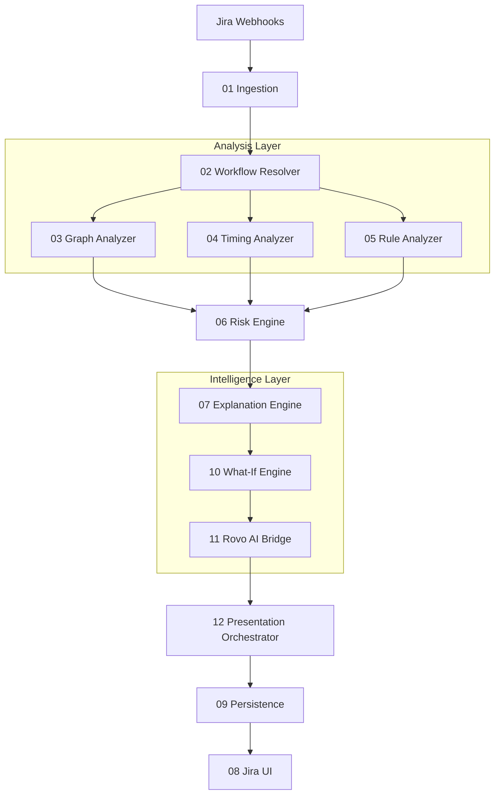

---

# 🚦 FlowSentry 2.0 — Intelligent Workflow Guard for Jira

### *Predictive Workflow Intelligence for Atlassian Teams*

[](https://developer.atlassian.com/platform/forge/)
[](https://www.typescriptlang.org/)
[](https://nodejs.org/)
[](https://opensource.org/licenses/MIT)
[](https://devpost.com/software/flowsentry-intelligent-workflow-guard-for-jira)

> **“Jira tells you what happened.
> FlowSentry tells you what’s about to go wrong — and why.”**

FlowSentry is a **native Atlassian Forge application** that continuously analyzes Jira workflows to detect **bottlenecks, structural risks, and automation conflicts** before they impact delivery.

---

## 📖 Table of Contents

* [🚨 Problem Statement](#-problem-statement)
* [💡 The FlowSentry Solution](#-the-flowsentry-solution)
* [🚀 Key Innovations (v2.0)](#-key-innovations-v20)
* [🏗️ System Architecture](#️-system-architecture)
* [🤖 Rovo AI Integration](#-rovo-ai-integration)
* [📊 Visual Insights](#-visual-insights)
* [🛠 Installation & Setup](#-installation--setup)
* [⚖️ Design Decisions](#️-design-decisions)
* [📜 License](#-license)

---

## 🚨 Problem Statement

Jira workflows evolve organically — and eventually silently break.

Teams continuously add:

* automation rules
* approval gates
* custom transitions
* exceptions for edge cases

Over time this creates **invisible complexity**.

### Common Failures

* **Hidden loops:** Issues bounce endlessly between states like `REVIEW → REWORK`.
* **Silent bottlenecks:** States such as `QA` or `IN_PROGRESS` silently absorb days of time.
* **Automation conflicts:** Multiple rules modify the same fields, causing race conditions.
* **Zero foresight:** Jira reports *what happened*, not *what is about to fail*.

Teams discover problems **after** a sprint is already lost.

---

## 💡 The FlowSentry Solution

FlowSentry is a **native workflow intelligence layer** embedded directly into Jira.

It continuously analyzes:

* workflow structure,
* state transitions,
* automation interactions,
* historical timing patterns,

…and turns them into **actionable insights** — not dashboards.

### What FlowSentry Provides

#### 🔍 Risk Score (0–1)

A deterministic score derived from:

* graph complexity
* state congestion
* automation overlap

#### ⏱ Bottleneck Detection

Identifies states with abnormal dwell time compared to sprint baselines.

#### 🧠 Actionable Recommendations

Human-readable suggestions such as:

* *“Add parallel review to reduce queue time.”*
* *“Add SLA to IN_PROGRESS to prevent stagnation.”*

#### ⚙️ Zero Configuration

No schema changes.
No setup.
Works instantly on existing Jira data
-------------


---

## 🚀 Key Innovations (v2.0)

### 🔮 Predictive “What-If” Engine

Simulate workflow changes before deploying them.

> *“What happens if we remove the QA gate?”*
> → Predicted risk reduction: **−22%**

---

### 🤖 Rovo AI Integration

FlowSentry integrates with **Atlassian Rovo** to enable natural language analysis.

Examples:

* *“Why are tickets stuck in Review?”*
* *“Which step is slowing delivery this sprint?”*

Responses are:

* grounded in real metrics
* explainable
* constrained by deterministic rules (no hallucinations)

---

### 🛡️ Safe Action Pipeline

Every recommendation is validated to ensure:

* no structural breakage
* no cyclic transitions
* no unsafe workflow mutations

---

## 🏗️ System Architecture

FlowSentry uses a **modular, contract-driven architecture** optimized for auditability and scale.



---

## 📊 Visual Insights

FlowSentry renders **directly inside Jira**:

* Issue Glance → high-level risk overview
* Issue Panel → deep diagnostic insights


---

## 🛠 Installation & Setup

### Prerequisites

* Node.js 20+
* Atlassian Forge CLI
* Jira Cloud site

### Local Development

```bash
# Install dependencies
npm install --no-audit --no-fund --legacy-peer-deps

# Run local demo mode (no Jira required)
npm run demo

# Deploy to Forge
forge deploy -e development

# Install app in Jira
forge install
```

---

## ⚖️ Design Decisions

* **Deterministic First**
  AI enhances explanation — it never decides outcomes.

* **Forge-Native Security**
  No data leaves Atlassian infrastructure.

* **Explainability > Black Box AI**
  Every score is traceable to concrete signals.

---

## 🧪 Evaluation Guide (For Judges)

To evaluate FlowSentry:

1. Open any Jira issue with FlowSentry enabled
2. View the **Risk Panel**
3. Observe:

   * Risk score
   * Bottlenecks
   * Recommendations
4. (Optional) Run demo mode for simulated scenarios

---

## 🚀 Roadmap

* Sprint-level risk aggregation
* Org-wide workflow health dashboards
* Confluence auto-reports
* Configurable risk weight tuning

---

## 📜 License

MIT License — see [`LICENSE`](LICENSE)

---

## 🔗 Links

* **Devpost:** [https://devpost.com/software/flowsentry-intelligent-workflow-guard-for-jira](https://devpost.com/software/flowsentry-intelligent-workflow-guard-for-jira)
* **Repository:** [https://github.com/BTE-AYUSH25/flowSentry-forge](https://github.com/BTE-AYUSH25/flowSentry-forge)

---

---
